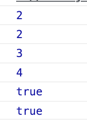
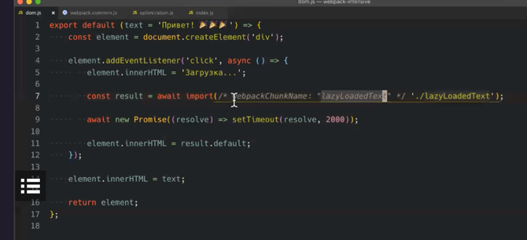
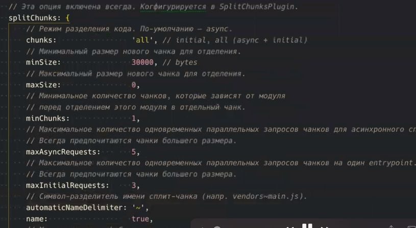
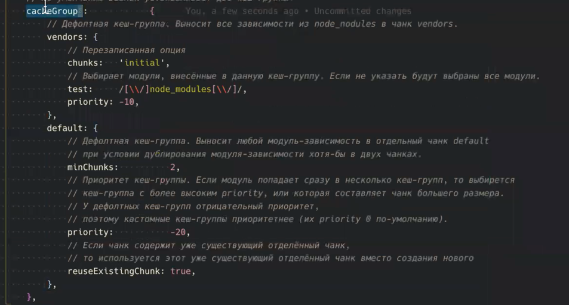

# Lesson 1
```
npm i -D webpack@4.29.1
npx webpack
y // install webpack-cli
```
---
npm scripts launch form node_modules

---
_modules concatenation_, _scope hoisting_
соединение импортов
---

_package.json_
```json
"build": "webpack --mode=development"
```
get source maps with _eval_

turn off source map:
```json
"build": "webpack --mode=development --devtool=false"
```

We'll configure webpack not with webpack-cli but with node scripts (01:33)
---

Webpack configuration types:
- object
- function
- promise

```javascript
module.exports = () => {
    return {
        mode: 'none',
        devtool: false,
    }
}
```
---
Example use of config with promise:
```javascript
module.exports = async () => {
    const port = await choosePort(3000);
}
```
---

`npm i -D html-webpack-plugin`

we can insert data from webpack
_/static/template.html_
```pug
    <title>
        <%= htmlWebpackPlugin.options.title %>
    </title>
```
```javascript
plugins: [
    new HtmlWebpackPlugin({
        template: "./static/template.html",
        title: "Lear webpack"
    })
```
---
Serving:
```

npm i -D serve
npx serve ./dist
```
_package.json_
```json
        "serve": "serve \"./dist\" -s"
```

# Lesson 2
Some working with paths,
clean-webpack-plugin

---
## Move to node run webpack
_build.js_
```javascript
/**
 * 1. webpack
 * 2. config
 * 3. create webpack compiler
 * 4. execution
 */

const webpack = require('webpack')
const chalk = require('chalk')

const config = require('./webpack.config')

const compiler = webpack(config);

compiler.run((error, stats) => {
    //...
});
```
Modify webpack console output:
```javascript
    const info = stats.toString({
        hash: true,
        modules: false,
    })

    console.log(chalk.greenBright('Build completed'))
    console.log(info)
```
---
Example of hooks:
https://webpack.js.org/api/compiler-hooks/
```javascript
compiler.hooks.done.tap({name: 'start', () => {
    console.log(' Compilation started ')
    // do smth ...
}})
```
## Handle css
_mini-css-extract-plugin_ for production
_style-loader css-loader_ for development
```
npm i -D mini-css-extract-plugin
npm i -D style-loader css-loader
```

Loaders are able to chain (from bottom to top)


_style-loader_ converts to js in order to use hot-reloading. Hot reloading can't work with external css files, only with <style> tags

_webpack.config.js_
```javascript
module: {
    rules: [
        {
            test: /\.css$/,
            use: [ 'style-loader', 'css-loader' ]
        }
    ]
}
```
---

## 1st look at webpack-dev-server

- Hot reloading is hard to maintain
- Hot reloading modifies code in dev mode, so it is different from prod

we'll test hot reloading
1. setup on server
2. setup on client
3. setup in webpack config
4. setup in source

Webpack V4
_start.js_
```javascript
        setupMiddlewares: (app) => { // add hot middleware
            app.use(
                hot(compiler, {
                    log: false,
                })
            )
        },
```
_webpack.config.js
```javascript
import {HotModuleReplacementPlugin} from "webpac";

        entry: [
            'webpack-hot-middleware/client?reload=true&quiet=true',
            SOURCE_DIRECTORY
        ],
    ...
        plugins:[
            ...
            new HotModuleReplacementPlugin()
        ]
```
_index.js_
```javascript
if (module.hot) {
    module.hot.accept('./simple-components/dom', function() {
        document.body.removeChild(element);
        element = component();
        document.body.appendChild(element);
    })
}
```

Webpack V5
out of the box?
---
react-hot-loader
used instead of webpack-hot-middleware.

# Lesson 3

## detect-port-alt

`npm i -D detect-port-alt inquirer`

---
**3 parts:**
- common
- dev
- prod


---
## babel
`% npm i -D babel-loader @babel/core`

_.babelrc.js_
caching babel config:
```javascript
api.cache.using();
```
---
preset - preconfigured set of plugins
`npm i -D @babel/preset-env`

preset_env doesn't support experimental syntax
`npm i -D @babel/plugin-proposal-class-properties`

makes code more resilient, but slower
```javascript
spec: true
```

make code faster but deviates standard
```javascript
loose: false
```

what types of modules transpiled to:
_cjs_ is bad for webpack optimization
```javascript
modules: false // 'cjs' is bad
```
---
01:05
_.browserslistrc_
---

react, react-dom, react-hot-loader
`npm i react react-dom`
`npm i -D react-hot-loader`
`npm i -D @babel/preset-react`

Modify babel config to setup for development through env

**NOTE: react-hot-loader already looks unnecessary**

---
Deal with css
use css modules:
```javascript
use: [
    'style-loader',
    {
        loader: 'css-loader',
        options: {
            modules: {localIdentName: '[path][name]__[local]--[hash:base64:5'},
        }
    }
]
```

install postcss:
`npm i -D postcss-loader`
`npm i -D postcss-preset-env`
inside postcss-preset-env we can setup options for any plugin
```javascript
use: [
    'style-loader',
    ...
    {
        loader: 'postcss-loader',
        options: {
            plugins: [
                env({
                    stage: 0,
                    features: {
                        'custom-media-queries': {
                            importFrom: [{
                                customMedia: {
                                    '--phonePortrait':
                                        '(width <= 414px)',
                                }
                            }]
                        }
                    }
                })
            ]
        }
    }
]
```


# Lesson 4.

About hot:


---
Excluding node_modules: on dev no, on prod yes because of modern syntax in old browsers
```javascript
test: /\.js$/,
exclude: /node_modules/,
```
---
## ES modules, devtools
Make node to be able to work with ES modules (import...from)

`npm install --save-dev @babel/register`
`npm install --save-dev cross-env`
_package.json_
```json
"start": "cross-env-shell NODE_ENV=development node --require @babel/register \"./scripts/webpack/start.js\"",
```
---
NOTE: babel is not merge, used the first available in the path chain
---

## Fix devtool
`devtool: 'eval-cheap-module-source-map'`
---

source map on prod is helpful when sentry used

_hidden-source-map_ - when source can't be shown for security reason
---

Error: process is not available:
`nmp i -D dotenv-webpack`
plugins:
`new DotenvWebpack(),`
---

## working with images: file-loader

`npm install file-loader --save-dev`
note not working: 
``

correct:
```jsx
import React from "react";
import myImg from "../theme/images/l4-1.png"
export const MyDom = () => {
    return (
        <div>
            hello
            
        </div>
    )
}
```
_webpack.common.js_
```javascript
{
    test: /\.(png|jpe?g|gif)$/i,
    use: [
        {
            loader: 'file-loader',
            options: {
                name: 'images/[name].[ext]'
            }
        },
    ],
},
```
---
split to modules:


## Working with svg
https://vecta.io/blog/best-way-to-embed-svg

`npm i -D @svgr/webpack`

_modules/svg.js_
```javascript
export const loadSvg = () => ({
    module: {
        rules: [
            {
                test: /\.svg$/,
                issuer: /\.js$/,
                use: [
                    '@svgr/webpack',
                    {
                        loader: 'file-loader',
                        options: {
                            name: './images/[name].[ext]'
                        }
                    }
                ]
            },
            {
                test: /\.svg$/,
                issuer: /\.css$/,
                use: [
                    {
                        loader: 'file-loader',
                        options: {
                            name: './images/[name].[ext]'
                        }
                    }
                ]
            }
        ]
    }
})
```

Note: convarting svg to base64 is bad because of productivity
---

## Fonts

Use in css:


Actual font


note: system-ui

## sass

## css: split to prod & dev, minify
Note: for good performance:
- load css for every page separately
- lazy load images
---
To extract css to a separate file:
`npm i -D mini-css-extract-plugin`

Split css into dev and prod
```javascript
export const loadProdCss = () =>({
    /**
     * mini-css-extract-plugin
     * css loader (minification is added)
     * postcss loader
     */
    module: {
        rules: [
            {
                test: /\.css$/,
                use: [
                    MiniCssExtractPlugin.loader,
                    ...
                ]
            }
        ]
    },
    plugins: [
        new MiniCssExtractPlugin({
            filename: '[name].[id].css',
            chunkFilename: '[name].[id].css',
        })
    ]
    ...
})
```
---
Use css nano to minify on prod
`npm i -D cssnano`

## Images optimization

images optimization must be done with specific soft, like optimage, not with webpack

`npm i -D image-minimizer-webpack-plugin imagemin-mozjpeg imagemin-pngquant imagemin-svgo`

_optimization.js_
```javascript
import ImageMinWebpackPlugin from "imagemin-webpack";
import imageminMozJpeg from "imagemin-mozjpeg";
import imageminPngQuant from "imagemin-pngquant";
import imageminSvgo from "imagemin-svgo";

export const optimizeImages = () => ({
    plugins: [
        new ImageMinWebpackPlugin({
            imageminOptions: {
                plugins: [
                    imageminMozJpeg({
                        progressive: true,
                        quality: 60,
                    }),
                    imageminPngQuant({
                        quality: 60,
                    }),
                    imageminSvgo()
                ]
            }
        })
    ]
})
```
---
NOTE:
publicPath - to set the root of assets path for plugins (problem with 404 for assets like images in css url);
_webpack.common.js_
```javascript
output: {
    path: BUILD_DIRECTORY,
    filename: "js/bundle.js",
    publicPath: "/",
```
---

## Environment

1. API (link to api whether dev or prod)
2. conditions (dev || prod)
3. feature flags
```javascript
if (RELEASE === '2.1') {
    //...
}
```
RELEASE - feature flag

---
_webpack.commor.js_
```javascript
plugins: [
    ...
    new DefinePlugin({
        RELEASE: '2.0',
        TWO: '1+1',
        THREE: JSON.stringify(3),
        FOUR: 4,
        TRUE_SIMPLE: true,
        TRUE_STRINGIFIED: JSON.stringify(true),
    })
```
_dom.jsx_
```javascript
    console.log(RELEASE)
    console.log(TWO)
    console.log(THREE)
    console.log(FOUR)
    console.log(TRUE_SIMPLE)
    console.log(TRUE_STRINGIFIED)
```


we must JSON.stringify strings

__IS_ADMIN__, __STAGE__, etc

--- 
dead brunch:
`if (false) {...}`
`if (__DEV__) {...}`
---
We can set API_URI as global variable, without import
---

# Lesson 6.
https://survivejs.com/

webpack-bar - show progress
webpack-friendly-errors - show errors friendly

## Assembling optimization

formidable: dashboards for webpack, node
---
webpack-contrib - repo with official packages
---

We'll use webpack-bundle-analyzer

`npm i -D webpack-bundle-analyzer`

_package.json_
```json
"analyze": "webpack-bundle-analyzer \"./build/stats.json\"",
```

_utils.js_
```javascript
export const connectBundleAnalyzer = () => ({
    plugins: [
        new BundleAnalyzerPlugin({
            analyzerMod: 'disabled',
            openAnalyzer: false,
            generateStatsFile: true,
        })
    ]
})
```
_webpack.prod.js_
```javascript
connectBundleAnalyzer(),
```
---
NOTE:
mode 'production', 'development' in NODE_ENV is overwritten with 
_webpack.prod.js_
`mode: 'none',`
---

Reviewing bundle.js
ieefe with a lot of arguments (~1200 strings)

---
Start build optimization:
_optimization.js_
```javascript
export const optimizeBuild = () => ({
    optimization: ...
})
```

some bugs can be fixed with:
```javascript
terserOptions: {
    safari10: true,
}
```
---
!Important: don't emit errors on prod:
We got error!
```javascript
noEmitOnError: true,
```
---
chunk is like a box with modules

code splitting: split into multiple chunks
```javascript
removeEmptyChunks: true,
```
---
chunks can contain other chunks as children
---
module concatenation (scope hoisting)
ES modules are transformed to IIFEs
```javascript
concatenateModules: true,
providedExports: true
```
dependency chain: providedExports => usedExports => occurenceOrder, concatenateModules
---
turn on tree shaking:
```javascript
sideEffects: true,
```
tree shaking works only with ES modules
---

Some settings are vulnerable;
like:
we need
_package.json_ of library
```json
"sideEffects: false
```
like
```javascript
        providedExports: true,
        usedExports: true,
```
is necessary for things like `concatenateModules`, `sideEffects`
---
modulesIds, chunksIds (alternatives namedModules, namedChunks deprecated) - modules in bundle.js are marked with paths, not with numbers
we need it for development
Hot reload is faster with pathes in webpack, not with array indexes. Array indexes are faste on prod.

# Lesson 7
## ContextReplacementPlugin: select moment locales
https://medium.com/webpack/webpack-4-mode-and-optimization-5423a6bc597a

## More on tree shaking
Tree shaking able packages must contain `sideEffect: false` in package.json

For example, we must use lodash-es to be able to tree shake

----
## Hashing
`filename: "js/[contenthash].[id].bundle.js",`
---
entrypoint - mandatory point
chunkFilename for splitpoint - cut from bundle, loading on demand
`chunkFilename: 'js/[name].[chunkhash:5].[id].bundle.js",'`

_css.js_
```javascript
new MiniCssExtractPlugin({
    filename: 'css/[name].[contenthash:5].[id].css',
    chunkFilename: 'css/[name].[contenthash:5].[id].css',
})
```
NOTE: every plugin and webpack have their own hashing algorithms

If files have hash, browser can apply caching:
*cache-control* header in http response is needed

## Code splitting

In simplest case code splitting works out of the box, but only by making split points

We want vendors to one hash and our code to another, becase we don't want browser to load vendor code when we update our app.

Initial chunk - vendors (need to configure)
Async chunks - our code (no need to configure out of the box);

_.babelrc_
```javascript
    const plugins = [
        '@babel/plugin-syntax-dynamic-import',
        // ...
    ];
```

lazy load in code:

comment - in order to name chunks in console

https://webpack.js.org/api/module-methods/#magic-comments

---
Dynamic imports, vendors to separate bundle
```javascript
splitChunks: {
    chunks: 'all',
    minSize: 30000,
}
```

minSize - minimal size of chunk (for vendors for example if their size if greqter than 30000)




Cache group inherits options of parent
